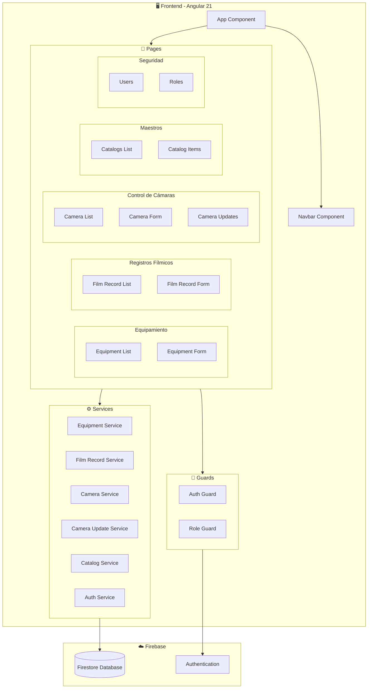
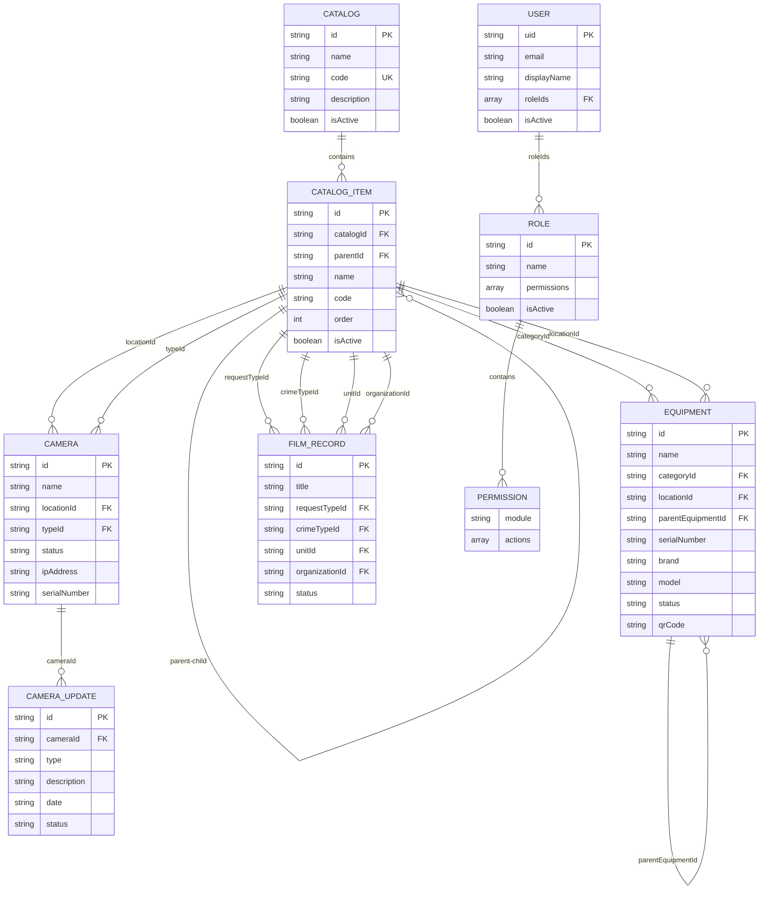
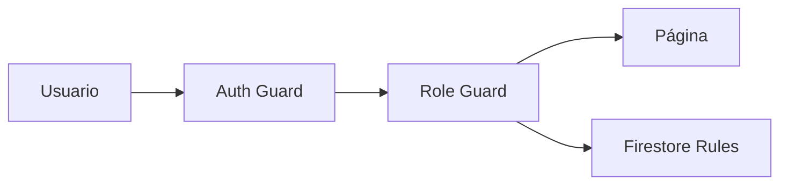
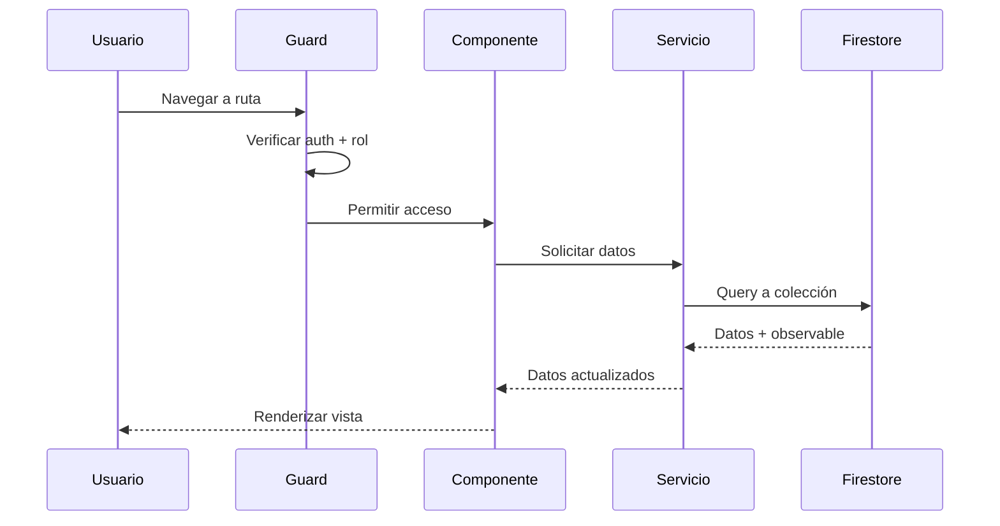

# 🏗️ Arquitectura del Sistema - Frontend

## Descripción General

**Angular Equipamiento** es una aplicación web desarrollada en Angular 21 para la gestión de equipamiento, registros fílmicos y control de cámaras del CREV. Utiliza Firebase como backend-as-a-service.

---

## 📊 Diagrama de Arquitectura



---

## 📁 Estructura del Proyecto

```
src/
├── app/
│   ├── app.ts                    # Componente principal
│   ├── app.config.ts             # Configuración de la aplicación
│   ├── app.routes.ts             # Definición de rutas
│   │
│   ├── components/               # Componentes reutilizables
│   │   └── navbar/
│   │
│   ├── guards/                   # Guards de autenticación/autorización
│   │   ├── auth.guard.ts
│   │   └── role.guard.ts
│   │
│   ├── models/                   # Modelos de datos
│   │   ├── models.ts             # Equipment, FilmRecord
│   │   ├── camera.model.ts       # Camera, CameraUpdate
│   │   ├── catalog.model.ts      # Catalog, CatalogItem
│   │   └── user.model.ts         # User, Role, Permission
│   │
│   ├── pages/                    # Páginas/Vistas
│   │   ├── equipment-list/
│   │   ├── equipment-form/
│   │   ├── film-record-list/
│   │   ├── film-record-form/
│   │   ├── camera-list/          # [NUEVO]
│   │   ├── camera-form/          # [NUEVO]
│   │   ├── camera-updates/       # [NUEVO]
│   │   ├── catalogs/             # [NUEVO]
│   │   ├── catalog-items/        # [NUEVO]
│   │   ├── users/                # [NUEVO]
│   │   └── roles/                # [NUEVO]
│   │
│   └── services/
│       ├── equipment.ts
│       ├── film-record.ts
│       ├── camera.ts             # [NUEVO]
│       ├── camera-update.ts      # [NUEVO]
│       ├── catalog.ts            # [NUEVO]
│       └── auth.ts               # [NUEVO]
│
├── environments/
└── styles.css
```

---

## 📄 Módulos del Sistema

### 1. Equipamiento (Existente)
| Página | Ruta | Descripción |
|--------|------|-------------|
| Lista | `/equipamiento` | Listado con estados y acciones |
| Nuevo | `/nuevo-equipo` | Formulario de creación |
| Editar | `/editar-equipo/:id` | Formulario de edición |

### 2. Registros Fílmicos (Existente)
| Página | Ruta | Descripción |
|--------|------|-------------|
| Lista | `/registros` | Listado de registros |
| Nuevo | `/nuevo-registro` | Formulario de creación |
| Editar | `/editar-registro/:id` | Formulario de edición |

### 3. Control de Cámaras (Nuevo)
| Página | Ruta | Descripción |
|--------|------|-------------|
| Lista | `/camaras` | Listado de cámaras |
| Nueva | `/nueva-camara` | Formulario de creación |
| Editar | `/editar-camara/:id` | Formulario de edición |
| Novedades | `/camaras/:id/novedades` | Historial de novedades |

### 4. Maestros/Catálogos (Nuevo)
| Página | Ruta | Descripción |
|--------|------|-------------|
| Catálogos | `/catalogos` | Lista de catálogos |
| Ítems | `/catalogos/:id/items` | Ítems de un catálogo |

### 5. Seguridad (Nuevo)
| Página | Ruta | Descripción |
|--------|------|-------------|
| Usuarios | `/usuarios` | Gestión de usuarios |
| Roles | `/roles` | Gestión de roles/permisos |

---

## 📊 Diagrama Entidad-Relación (DER)



---

## 📦 Modelos de Datos

### Equipment (Equipamiento)
```typescript
interface Equipment {
    id?: string;
    name: string;
    categoryId: string;           // Referencia a CatalogItem
    locationId?: string;          // Referencia a CatalogItem (ubicación)
    parentEquipmentId?: string;   // Para jerarquía de equipos
    serialNumber?: string;
    brand?: string;
    model?: string;
    status: 'Disponible' | 'En Reparación' | 'Entregado' | 'Baja';
    description?: string;
    qrCode?: string;
    // Auditoría
    createdAt: Timestamp;
    createdBy: string;
    updatedAt?: Timestamp;
    updatedBy?: string;
}
```

### Camera (Cámara)
```typescript
interface Camera {
    id?: string;
    name: string;
    locationId: string;           // Referencia a CatalogItem
    typeId: string;               // Referencia a CatalogItem (tipo)
    status: 'Operativa' | 'Con Falla' | 'Fuera de Servicio' | 'Mantenimiento';
    ipAddress?: string;
    serialNumber?: string;
    installationDate?: string;
    notes?: string;
    // Auditoría
    createdAt: Timestamp;
    createdBy: string;
    updatedAt?: Timestamp;
    updatedBy?: string;
}

interface CameraUpdate {
    id?: string;
    cameraId: string;
    type: 'Falla' | 'Reparación' | 'Mantenimiento' | 'Observación';
    description: string;
    date: string;
    reportedBy: string;
    resolvedAt?: string;
    resolvedBy?: string;
    status: 'Abierta' | 'Cerrada';
    // Auditoría
    createdAt: Timestamp;
    createdBy: string;
}
```

### Catalog & CatalogItem (Maestros)
```typescript
interface Catalog {
    id?: string;
    name: string;                 // Ej: "Categorías", "Ubicaciones", "Tipos de Cámara"
    description?: string;
    isActive: boolean;
    createdAt: Timestamp;
}

interface CatalogItem {
    id?: string;
    catalogId: string;            // Referencia al catálogo padre
    parentId?: string;            // Para items jerárquicos
    name: string;
    code?: string;
    order: number;
    isActive: boolean;
    createdAt: Timestamp;
}
```

> [!IMPORTANT]
> **Diseño de Referencias:** Guardar siempre `IDs` de catálogo (ej: `locationId`) y no el texto. Si cambia el nombre de una opción, no cambia el histórico.

### User & Role (Seguridad)
```typescript
interface User {
    uid: string;                  // Firebase Auth UID
    email: string;
    displayName: string;
    roleIds: string[];            // Referencias a roles
    isActive: boolean;
    createdAt: Timestamp;
    lastLoginAt?: Timestamp;
}

interface Role {
    id?: string;
    name: string;                 // Ej: "Admin", "Operador", "Consulta"
    description?: string;
    permissions: Permission[];
    isActive: boolean;
}

interface Permission {
    module: string;               // Ej: "equipamiento", "camaras"
    actions: ('read' | 'create' | 'update' | 'delete')[];
}
```

---

## 🔐 Seguridad (RBAC)

### Arquitectura de Autorización



### Guards de Angular
- **AuthGuard:** Verifica autenticación (`canActivate`)
- **RoleGuard:** Verifica permisos por rol

### Firestore Security Rules
```javascript
rules_version = '2';
service cloud.firestore {
  match /databases/{database}/documents {
    // Helper: verificar rol
    function hasRole(role) {
      return get(/databases/$(database)/documents/users/$(request.auth.uid))
        .data.roleIds.hasAny([role]);
    }
    
    // Equipamiento: lectura todos, escritura solo admin/operador
    match /equipamiento/{doc} {
      allow read: if request.auth != null;
      allow write: if hasRole('admin') || hasRole('operador');
    }
    
    // Catálogos: solo admin
    match /catalogs/{doc} {
      allow read: if request.auth != null;
      allow write: if hasRole('admin');
    }
  }
}
```

---

## 🔄 Catálogos Compartidos

Los combos de todos los módulos se alimentan del sistema de **Catálogos**:

| Catálogo | Usado en |
|----------|----------|
| Categorías | Equipamiento |
| Ubicaciones | Equipamiento, Cámaras |
| Estados Equipo | Equipamiento |
| Tipos de Cámara | Cámaras |
| Tipos de Solicitud | Registros Fílmicos |
| Delitos | Registros Fílmicos |

### Jerarquía de Catálogos

Los `CatalogItem` pueden tener un `parentId` para crear jerarquías:

```
Ubicaciones
├── Edificio Central
│   ├── Planta Baja
│   └── Primer Piso
└── Edificio Anexo
    └── Depósito
```

---

## 🔄 Flujo de Datos


