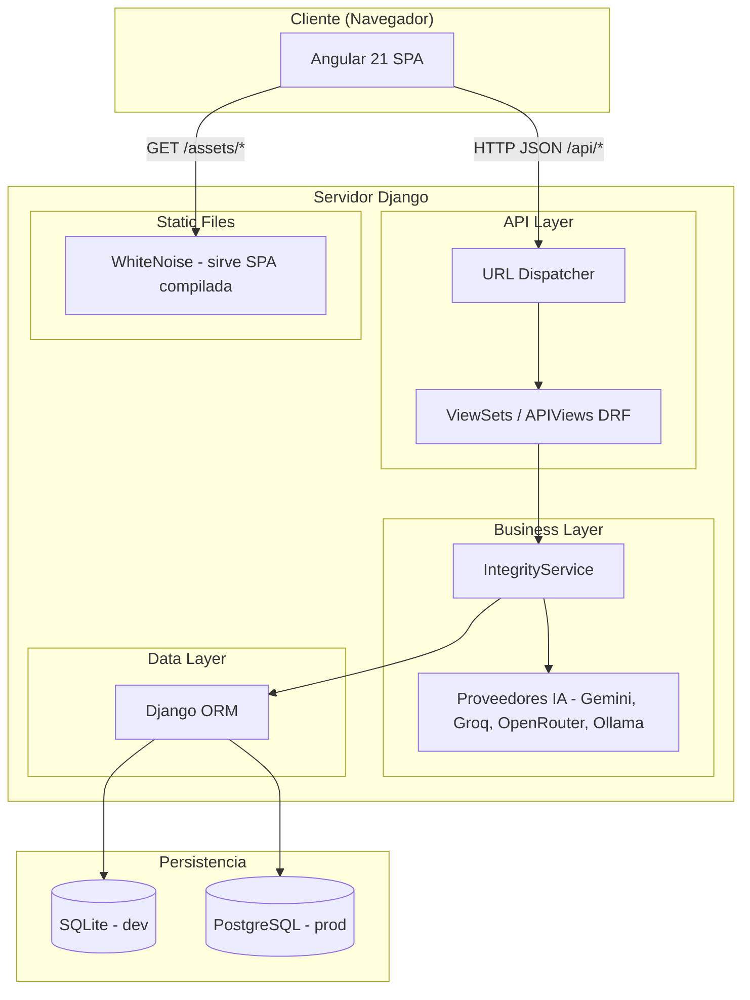
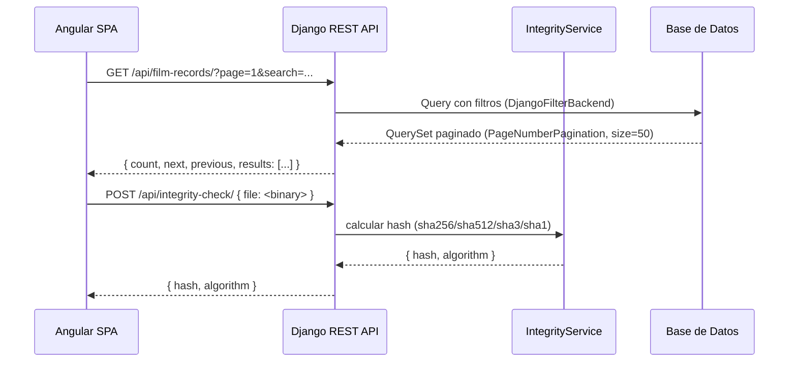

# Arquitectura del Sistema - GestorCOC

> **Estilo Arquitectonico**: API REST desacoplada + SPA (Single Page Application).
> **Backend**: Django 5.2 + Django REST Framework.
> **Frontend**: Angular 21 (standalone components) + Tailwind CSS v4.

---

## 1. Diagrama de Bloques

> Diagrama PlantUML: [`arquitectura.puml`](./arquitectura.puml)



---

## 2. Patron por App

Cada app Django sigue el patron:

```
models.py → serializers.py → views.py (ViewSets/APIViews) → urls.py
```

| App | Responsabilidad |
|-----|-----------------|
| `config/` | Settings, URL root, DRF, drf-spectacular |
| `core/` | `TimeStampedModel` (base abstracta con `created_at`/`updated_at`) + comando `seed_data` |
| `assets/` | Unidades, sistemas CCTV, servidores, camaras, equipamiento de camarografo |
| `novedades/` | Novedades operativas (fallas, eventos) |
| `personnel/` | Personal del COC (`Person`) y personal externo (`ExternalPerson`) |
| `records/` | Registros filmicos, catalogos, informes de video, uso de IA, dashboard |
| `hechos/` | Bitacora operativa |

---

## 3. Jerarquia de Activos

```
Unit (COC / aeropuerto)
  └── System (NVR o CCTV)
        └── Server (IP unica)
              └── Camera (ONLINE | OFFLINE | MAINTENANCE)

CameramanGear  ← independiente (vinculado opcionalmente a Person)
```

`Unit` puede tener una `Unit` padre (jerarquia de entidades: COC dependiente de CREV).

---

## 4. Flujo de Datos: Frontend → Backend



---

## 5. Paginacion y Filtros

- **Global**: `PageNumberPagination`, `PAGE_SIZE = 50`.
- **Por ViewSet**: `DjangoFilterBackend + SearchFilter + OrderingFilter`.
- El frontend pasa `?page=N&search=X&campo=valor`.
- Respuesta estandar DRF: `{ count, next, previous, results }`.

---

## 6. Informes e IA

`records/services.py` — `IntegrityService` centraliza:
- Calculo de hash de archivo (SHA-1, SHA-3, SHA-256, SHA-512).
- Generacion de PDF de integridad.
- Generacion de DOCX de analisis de video.
- Mejora textual con IA (con fallback entre proveedores).
- Log de uso en `AIUsageLog`.

**Proveedores IA** (orden y seleccion configurable via `.env`):
- `GEMINI`, `OPENROUTER`, `GROQ` (configurados en `.env.example`)
- `OLLAMA` (soportado en el codigo, requiere configuracion manual)

**Limites en `config/settings.py`**:
- `VIDEO_REPORT_MAX_FRAMES = 30`
- `VIDEO_REPORT_MAX_FRAME_SIZE_BYTES = 8 MB`
- `VIDEO_REPORT_MAX_TOTAL_BYTES = 80 MB`

---

## 7. Despliegue

| Entorno | Base de datos | Servidor | Frontend |
|---------|--------------|----------|----------|
| Desarrollo | SQLite (`backend/db.sqlite3`) | `manage.py runserver` | `npm start` (:4200, proxy a :8000) |
| Produccion | PostgreSQL (via `DATABASE_URL`) | Gunicorn | WhiteNoise (sirve `frontend/dist/gestor-coc/browser/`) |

- Railway usa `DATABASE_URL` automaticamente.
- WhiteNoise configurado con `WHITENOISE_ROOT` apuntando al build de Angular.
- Health check: `GET /api/health/`.

---

## 8. Documentacion de API

- Swagger UI: `/swagger/` o `/api/schema/swagger-ui/`
- ReDoc: `/api/schema/redoc/`
- Schema OpenAPI: `/api/schema/`
