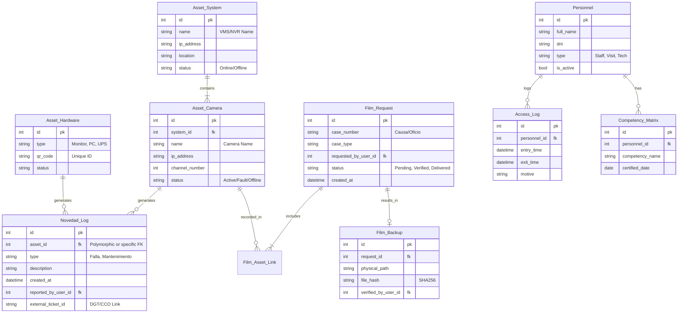

# Modelo de Datos - GestorCOC v2.0

> **Estrategia**: Base de datos relacional estricta para garantizar la integridad referencial.
> **Motor Sugerido**: SQLite (Dev/Small Apps) o PostgreSQL (Prod).

## 1. Diagrama Entidad-Relación (DER)

## 2. Diccionario de Datos

### 2.1 Tablas Principales

#### `Asset_Camera` (Cámaras)
*   **id**: PRIMARY KEY
*   **system_id**: FOREIGN KEY -> `Asset_System(id)`
*   **name**: VARCHAR(100). Nombre lógico (ej: "Camara Acceso Principal").
*   **ip_address**: VARCHAR(45).
*   **status**: ENUM('OK', 'FAIL', 'OFFLINE'). Estado actual derivado de la última novedad.

#### `Novedad_Log` (Fallas/Eventos)
*   **asset_id**: Referencia al equipo afectado.
*   **external_ticket_id**: VARCHAR(50). NULLABLE. ID del ticket en DGT/CCO si corresponde.
*   **severity**: ENUM('LOW', 'MEDIUM', 'HIGH', 'CRITICAL').
*   **state**: ENUM('OPEN', 'CLOSED').

#### `Film_Backup` (Evidencia Digital)
*   **request_id**: FOREIGN KEY -> `Film_Request(id)`.
*   **physical_path**: TEXT. Ruta absoluta en el storage (ej: `/mnt/storage/2026/01/Causa_555`).
*   **file_hash**: VARCHAR(64). Hash SHA-256 del archivo masivo (.zip o .dav).
*   **hash_verified_at**: DATETIME. NULL si no está verificado.

#### `Personnel` (Personas)
*   **dni**: UNIQUE INDEX.
*   **is_whitelist**: BOOLEAN. Si está en la lista blanca de acceso automático.
