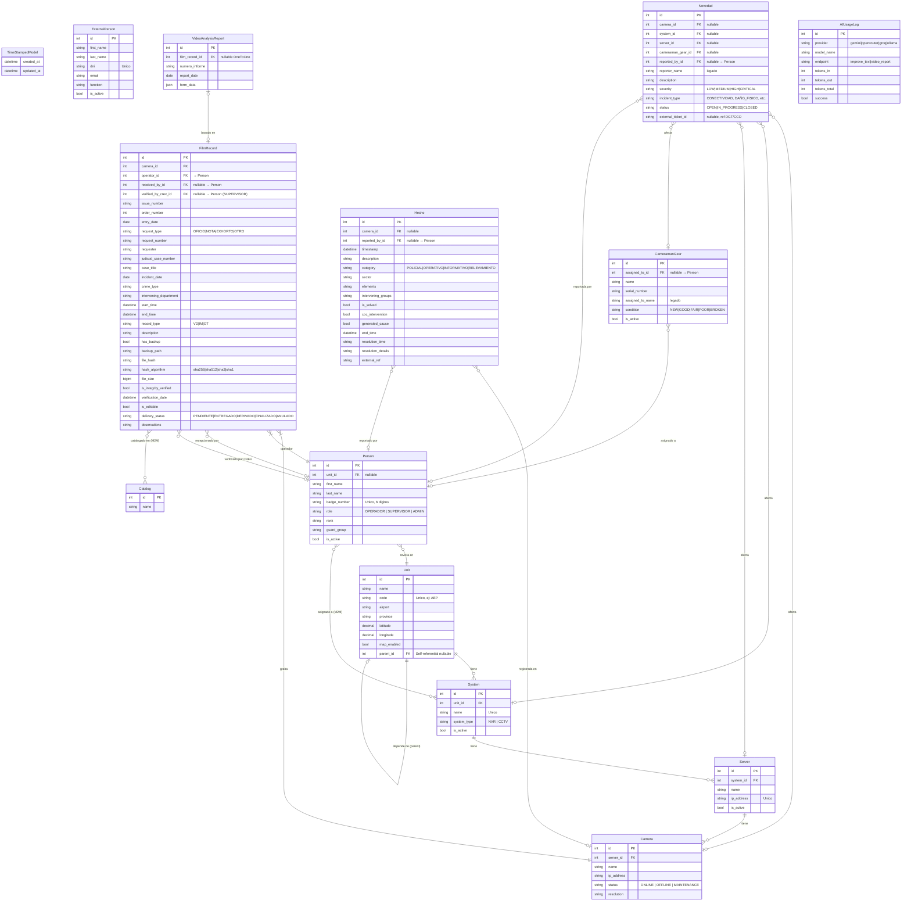

# Modelo de Datos - GestorCOC

> Base de datos relacional. Desarrollo: SQLite. Produccion: PostgreSQL.
> Todos los modelos heredan de `TimeStampedModel` (campos `created_at`, `updated_at`).

---

## 1. Diagrama Entidad-Relacion (DER)

> Diagramas PlantUML: [`modelo_datos.puml`](./modelo_datos.puml) | [`jerarquia_activos.puml`](./jerarquia_activos.puml)

```mermaid
erDiagram

    %% CORE
    TimeStampedModel {
        datetime created_at
        datetime updated_at
    }

    %% ASSETS
    Unit {
        int id PK
        string name
        string code "Unico, ej: AEP"
        string airport
        string province
        decimal latitude
        decimal longitude
        bool map_enabled
        int parent_id FK "Self-referential nullable"
    }

    System {
        int id PK
        int unit_id FK
        string name "Unico"
        string system_type "NVR | CCTV"
        bool is_active
    }

    Server {
        int id PK
        int system_id FK
        string name
        string ip_address "Unico"
        bool is_active
    }

    Camera {
        int id PK
        int server_id FK
        string name
        string ip_address
        string status "ONLINE | OFFLINE | MAINTENANCE"
        string resolution
    }

    CameramanGear {
        int id PK
        int assigned_to_id FK "nullable → Person"
        string name
        string serial_number
        string assigned_to_name "legado"
        string condition "NEW|GOOD|FAIR|POOR|BROKEN"
        bool is_active
    }

    %% PERSONNEL
    Person {
        int id PK
        int unit_id FK "nullable"
        string first_name
        string last_name
        string badge_number "Unico, 6 digitos"
        string role "OPERADOR | SUPERVISOR | ADMIN"
        string rank
        string guard_group
        bool is_active
    }

    ExternalPerson {
        int id PK
        string first_name
        string last_name
        string dni "Unico"
        string email
        string function
        bool is_active
    }

    %% NOVEDADES
    Novedad {
        int id PK
        int camera_id FK "nullable"
        int system_id FK "nullable"
        int server_id FK "nullable"
        int cameraman_gear_id FK "nullable"
        int reported_by_id FK "nullable → Person"
        string reporter_name "legado"
        string description
        string severity "LOW|MEDIUM|HIGH|CRITICAL"
        string incident_type "CONECTIVIDAD, DAÑO_FISICO, etc."
        string status "OPEN|IN_PROGRESS|CLOSED"
        string external_ticket_id "nullable, ref DGT/CCO"
    }

    %% HECHOS
    Hecho {
        int id PK
        int camera_id FK "nullable"
        int reported_by_id FK "nullable → Person"
        datetime timestamp
        string description
        string category "POLICIAL|OPERATIVO|INFORMATIVO|RELEVAMIENTO"
        string sector
        string elements
        string intervening_groups
        bool is_solved
        bool coc_intervention
        bool generated_cause
        datetime end_time
        string resolution_time
        string resolution_details
        string external_ref
    }

    %% RECORDS
    FilmRecord {
        int id PK
        int camera_id FK
        int operator_id FK "→ Person"
        int received_by_id FK "nullable → Person"
        int verified_by_crev_id FK "nullable → Person (SUPERVISOR)"
        string issue_number
        int order_number
        date entry_date
        string request_type "OFICIO|NOTA|EXHORTO|OTRO"
        string request_number
        string requester
        string judicial_case_number
        string case_title
        date incident_date
        string crime_type
        string intervening_department
        datetime start_time
        datetime end_time
        string record_type "VD|IM|OT"
        string description
        bool has_backup
        string backup_path
        string file_hash
        string hash_algorithm "sha256|sha512|sha3|sha1"
        bigint file_size
        bool is_integrity_verified
        datetime verification_date
        bool is_editable
        string delivery_status "PENDIENTE|ENTREGADO|DERIVADO|FINALIZADO|ANULADO"
        string observations
    }

    Catalog {
        int id PK
        string name
    }

    VideoAnalysisReport {
        int id PK
        int film_record_id FK "nullable OneToOne"
        string numero_informe
        date report_date
        json form_data
    }

    AIUsageLog {
        int id PK
        string provider "gemini|openrouter|groq|ollama"
        string model_name
        string endpoint "improve_text|video_report"
        int tokens_in
        int tokens_out
        int tokens_total
        bool success
    }

    %% RELACIONES
    Unit ||--o{ System : "tiene"
    Unit ||--o| Unit : "depende de (parent)"
    System ||--o{ Server : "tiene"
    Server ||--o{ Camera : "tiene"

    Person }o--|| Unit : "revista en"
    Person }o--o{ System : "asignado a (M2M)"

    CameramanGear }o--o| Person : "asignado a"

    Novedad }o--o| Camera : "afecta"
    Novedad }o--o| System : "afecta"
    Novedad }o--o| Server : "afecta"
    Novedad }o--o| CameramanGear : "afecta"
    Novedad }o--o| Person : "reportada por"

    Hecho }o--o| Camera : "registrada en"
    Hecho }o--o| Person : "reportado por"

    FilmRecord }|--|| Camera : "graba"
    FilmRecord }|--|| Person : "operador"
    FilmRecord }o--o| Person : "recepcionado por"
    FilmRecord }o--o| Person : "verificado por CREV"
    FilmRecord }o--o{ Catalog : "catalogado en (M2M)"

    VideoAnalysisReport |o--o| FilmRecord : "basado en"
```

---

## 2. Diccionario de Datos

### `Unit` — Unidades COC / Aeropuertos

| Campo | Tipo | Descripcion |
|-------|------|-------------|
| `code` | VARCHAR(10) UNIQUE | Codigo corto (ej: AEP, EZE) |
| `latitude` / `longitude` | DECIMAL(9,6) | Para el mapa georreferenciado |
| `map_enabled` | BOOLEAN | Si aparece en el mapa del dashboard |
| `parent` | FK self nullable | Jerarquia (CREV superior) |

### `System` — Sistemas CCTV / NVR

| Campo | Tipo | Descripcion |
|-------|------|-------------|
| `system_type` | ENUM | `NVR` (solo grabador) o `CCTV` (sistema completo) |
| `name` | VARCHAR(100) UNIQUE | Nombre tecnico, ej: SITE-01-NVR |

### `Camera` — Camaras

| Campo | Tipo | Descripcion |
|-------|------|-------------|
| `status` | ENUM | `ONLINE` / `OFFLINE` / `MAINTENANCE` |
| `server` | FK nullable | Vinculada al servidor grabador |

### `Person` — Personal COC

| Campo | Tipo | Descripcion |
|-------|------|-------------|
| `badge_number` | VARCHAR(6) UNIQUE | Legajo de 6 digitos |
| `role` | ENUM | `OPERADOR` / `SUPERVISOR` / `ADMIN` |
| `rank` | ENUM | Jerarquia policial o CIVIL |
| `guard_group` | VARCHAR(50) nullable | Grupo de guardia |

> Solo `SUPERVISOR` puede actuar como verificador CREV en `FilmRecord`.

### `Novedad` — Novedades Operativas

| Campo | Tipo | Descripcion |
|-------|------|-------------|
| `camera/system/server/cameraman_gear` | FK nullable | Activo afectado (polimorfismo simple) |
| `severity` | ENUM | `LOW` / `MEDIUM` / `HIGH` / `CRITICAL` |
| `status` | ENUM | `OPEN` / `IN_PROGRESS` / `CLOSED` |
| `external_ticket_id` | VARCHAR(50) nullable | ID de ticket en DGT/CCO |
| `reporter_name` | VARCHAR(100) | Nombre libre (campo legado) |

### `FilmRecord` — Registros Filmicos

| Campo | Tipo | Descripcion |
|-------|------|-------------|
| `judicial_case_number` | VARCHAR(100) INDEXED | Nro de causa judicial |
| `file_hash` | VARCHAR(128) INDEXED | Hash del archivo de evidencia |
| `hash_algorithm` | ENUM | `sha256` / `sha512` / `sha3` / `sha1` |
| `delivery_status` | ENUM | `PENDIENTE` → `ENTREGADO` / `DERIVADO` / `FINALIZADO` / `ANULADO` |
| `is_editable` | BOOLEAN | `False` automaticamente al ser verificado por CREV |
| `verified_by_crev` | FK nullable → Person | Solo `SUPERVISOR` |

### `AIUsageLog` — Log de Uso de IA

| Campo | Tipo | Descripcion |
|-------|------|-------------|
| `provider` | ENUM | `gemini` / `openrouter` / `groq` / `ollama` |
| `endpoint` | ENUM | `improve_text` / `video_report` |
| `tokens_in/out/total` | INT | Tokens consumidos |

---

## 3. Campos de Legado

Dos campos FK migraron desde texto libre. Los valores historicos se preservan:

| Modelo | Campo FK | Campo legado (texto) |
|--------|----------|---------------------|
| `Novedad` | `reported_by` → `Person` | `reporter_name` (CharField) |
| `CameramanGear` | `assigned_to` → `Person` | `assigned_to_name` (CharField) |

Los serializers exponen `reported_by_name` y `assigned_to_display` como campos read-only calculados.
