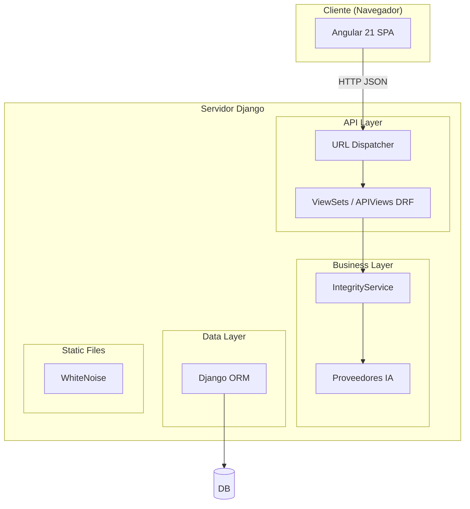

# Arquitectura - Visión General

> Derivado de `Arquitectura.md` original.

## 1. Diseño del Sistema
GestorCOC utiliza una arquitectura desacoplada con un **Backend API REST** (Django) y un **Frontend SPA** (Angular).

## 2. Diagrama de Bloques

## 3. Distribución de Apps
- `assets/`: Inventario CCTV y equipamiento.
- `novedades/`: Fallas y eventos.
- `personnel/`: Gestión de personal.
- `records/`: Registros fílmicos y servicios IA.
- `hechos/`: Bitácora operativa.
