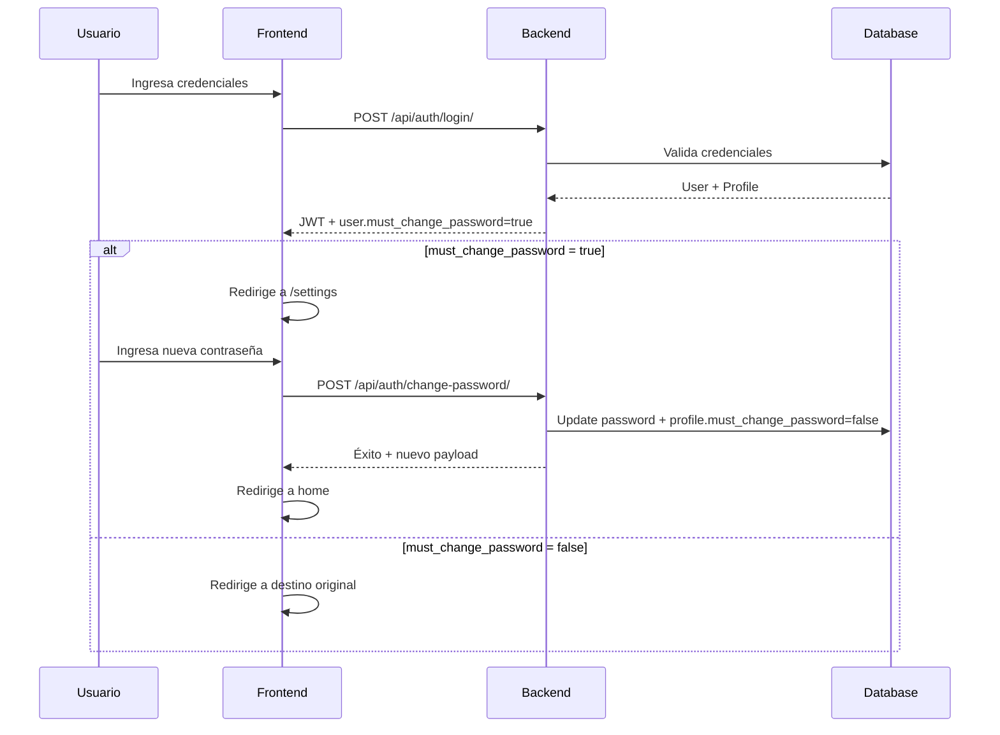

# Gestión de Contraseñas - Tipo Active Directory

> **Descripción**: Documentación sobre la gestión de contraseñas de usuarios, permitiendo al admin forzar el cambio de contraseña similar a Active Directory.

## 📋 Resumen

El sistema ahora permite al administrador:
1. **Forzar cambio de contraseña** en el próximo login
2. **Marcar contraseña como permanente** (no requiere cambio)
3. **Restablecer contraseña** con temporal forzado
4. **Ver estado** de cada usuario (cambio pendiente o permanente)

---

## 🎯 Funcionalidades Tipo Active Directory

### 1. Forzar Cambio de Contraseña

**¿Qué hace?**: Obliga al usuario a cambiar su contraseña en el próximo inicio de sesión.

**Cuándo usarlo**:
- Rotación periódica de contraseñas
- Sospecha de compromiso de contraseña
- Política de seguridad requiere cambio
- Nuevo usuario con contraseña temporal

**Cómo hacerlo**:
1. Ir a **Usuarios** en el panel de administración
2. Click en el ícono de **llave** (🔑) junto al usuario
3. Seleccionar **"Forzar cambio en próximo login"**
4. Confirmar la acción

**Resultado**:
- El usuario verá un indicador "Cambio pendiente" en su próxima sesión
- Deberá cambiar la contraseña antes de usar el sistema

---

### 2. Marcar como Permanente

**¿Qué hace?**: Marca la contraseña actual como permanente, eliminando la obligación de cambio.

**Cuándo usarlo**:
- Admin cambia contraseña pero no requiere rotación inmediata
- Usuario olvidó que tenía cambio pendiente
- Excepción aprobada por seguridad

**Cómo hacerlo**:
1. Ir a **Usuarios**
2. Click en el ícono de **llave** (🔑) del usuario
3. Si tiene "Cambio pendiente", seleccionar **"Marcar como permanente"**
4. Confirmar

**Resultado**:
- Se elimina el indicador "Cambio pendiente"
- El usuario puede usar su contraseña normalmente

---

### 3. Restablecer Contraseña

**¿Qué hace?**: El admin establece una nueva contraseña temporal para el usuario.

**Cuándo usarlo**:
- Usuario olvidó su contraseña
- Cuenta bloqueada
- Primer acceso de usuario

**Cómo hacerlo**:
1. Ir a **Usuarios**
2. Click en el ícono de **llave** (🔑)
3. Seleccionar **"Restablecer contraseña"**
4. Ingresar nueva contraseña temporal (mínimo 6 caracteres)
5. Confirmar

**Resultado**:
- Contraseña actualizada inmediatamente
- **Automáticamente fuerza el cambio** en el próximo login
- Usuario debe cambiarla al iniciar sesión

---

## 📊 Estados de Contraseña

| Estado | Indicador | Descripción |
|--------|-----------|-------------|
| **Permanente** | Ninguno | Contraseña válida, no requiere cambio |
| **Cambio Pendiente** | 🟡 Badge amarillo "Cambio pendiente" | Usuario debe cambiar contraseña |

---

## 🔧 Implementación Técnica

### Backend (Django)

**Endpoints nuevos en `UserManagementViewSet`**:

```python
# Forzar cambio de contraseña
POST /api/users/{id}/force_password_change/
# Response: {"message": "Se ha forzado el cambio..."}

# Marcar como permanente
POST /api/users/{id}/clear_password_change/
# Response: {"message": "La contraseña ha sido marcada como permanente."}

# Restablecer contraseña (ya existente)
POST /api/users/{id}/reset_password/
# Body: {"password": "nueva_password"}
```

**Modelo**:
```python
class UserAccountProfile(models.Model):
    user = models.OneToOneField(User, on_delete=models.CASCADE)
    must_change_password = models.BooleanField(default=True)
```

### Frontend (Angular)

**Servicio** (`user-management.service.ts`):
```typescript
forcePasswordChange(id: number): Observable<{ message: string }>
clearPasswordChange(id: number): Observable<{ message: string }>
resetPassword(id: number, password: string): Observable<{ message: string }>
```

**Componente Usuarios**:
- Menú desplegable con 3 opciones
- Confirmación antes de ejecutar acciones
- Toast de notificación con resultado

---

## 🔐 Flujo de Usuario con Cambio Forzado



---

## 📖 Comparación con Active Directory

| Funcionalidad | Active Directory | GestorCOC |
|--------------|------------------|-----------|
| Forzar cambio en próximo login | ✅ `pwdLastSet = 0` | ✅ `must_change_password = true` |
| Usuario debe cambiar contraseña | ✅ Sí | ✅ Sí (bloquea hasta cambiar) |
| Admin resetea contraseña | ✅ Sí | ✅ Sí |
| Contraseña temporal forzada | ✅ Sí | ✅ Sí (automático al resetear) |
| Marcar como permanente | ✅ `pwdLastSet = -1` | ✅ `must_change_password = false` |
| Política de expiración | ✅ Sí (GPO) | ⏸️ Pendiente |
| Historial de contraseñas | ✅ Sí | ❌ No implementado |
| Complejidad de contraseña | ✅ Sí | ✅ Sí (validadores Django) |

---

## 🚀 Comandos Útiles

### Ver estado de usuarios desde Django Shell

```bash
cd backend
python manage.py shell
```

```python
from django.contrib.auth import get_user_model
from personnel.models import UserAccountProfile

User = get_user_model()

# Ver usuarios con cambio pendiente
for user in User.objects.filter(account_profile__must_change_password=True):
    print(f"{user.username}: Cambio pendiente")

# Forzar cambio manualmente
user = User.objects.get(username='juan')
profile, _ = UserAccountProfile.objects.get_or_create(user=user)
profile.must_change_password = True
profile.save()
```

### Resetear contraseña de admin desde script

```bash
python backend/reset_admin_password.py
```

---

## 🛡️ Buenas Prácticas

### Para el Admin

1. **Rotación periódica**: Forzar cambio cada 60-90 días
2. **Monitoreo**: Revisar usuarios con cambio pendiente > 7 días
3. **Excepciones**: Documentar usuarios exentos de rotación
4. **Auditoría**: Revisar logs de cambios de contraseña

### Para el Usuario

1. **Contraseña fuerte**: Mínimo 6 caracteres (recomendado 12+)
2. **No reutilizar**: Evitar usar contraseñas anteriores
3. **Cambio inmediato**: Si sospecha compromiso, avisar al admin
4. **No compartir**: Nunca compartir contraseña temporal

---

## 📝 Ejemplos de Uso

### Escenario 1: Rotación Mensual

```
1. Admin va a Usuarios
2. Filtra por rol (ej: OPERADOR)
3. Para cada usuario:
   - Click en 🔑 → "Forzar cambio en próximo login"
4. Usuarios ven notificación en próximo login
```

### Escenario 2: Usuario Olvidó Contraseña

```
1. Usuario reporta olvido de contraseña
2. Admin va a Usuarios
3. Busca usuario por nombre/legajo
4. Click en 🔑 → "Restablecer contraseña"
5. Ingresa contraseña temporal (ej: Temp123456!)
6. Informa al usuario la contraseña temporal
7. Usuario cambia al iniciar sesión
```

### Escenario 3: Excepción Aprobada

```
1. Usuario reporta que viajará y no puede cambiar contraseña
2. Supervisor aprueba excepción
3. Admin va a Usuarios
4. Busca usuario
5. Click en 🔑 → "Marcar como permanente"
6. Usuario puede usar su contraseña sin cambio
```

---

## 🔍 Troubleshooting

### El usuario no ve el mensaje de cambio obligatorio

**Causa**: Navegador con caché antiguo

**Solución**:
1. Usuario debe hacer logout completo
2. Limpiar caché del navegador
3. Volver a login

### Admin no puede forzar cambio

**Causa**: No tiene permiso `manage_users`

**Solución**:
- Verificar que el admin tenga rol `ADMIN`
- Revisar permisos en `/api/auth/me/`

### Cambio de contraseña falla

**Causas posibles**:
- Contraseña muy corta (< 6 caracteres)
- Contraseña igual a la anterior
- Validadores de Django rechazan contraseña

**Solución**:
- Usar contraseña más compleja
- Incluir mayúsculas, números, símbolos

---

*Documento creado el 25 de marzo de 2026*
