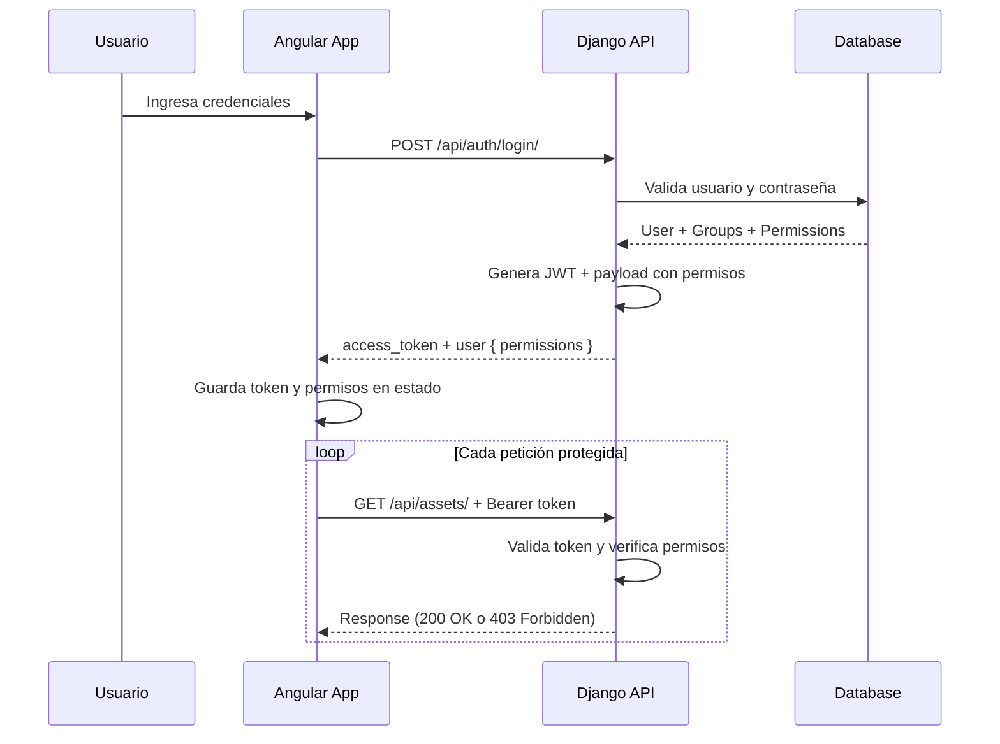
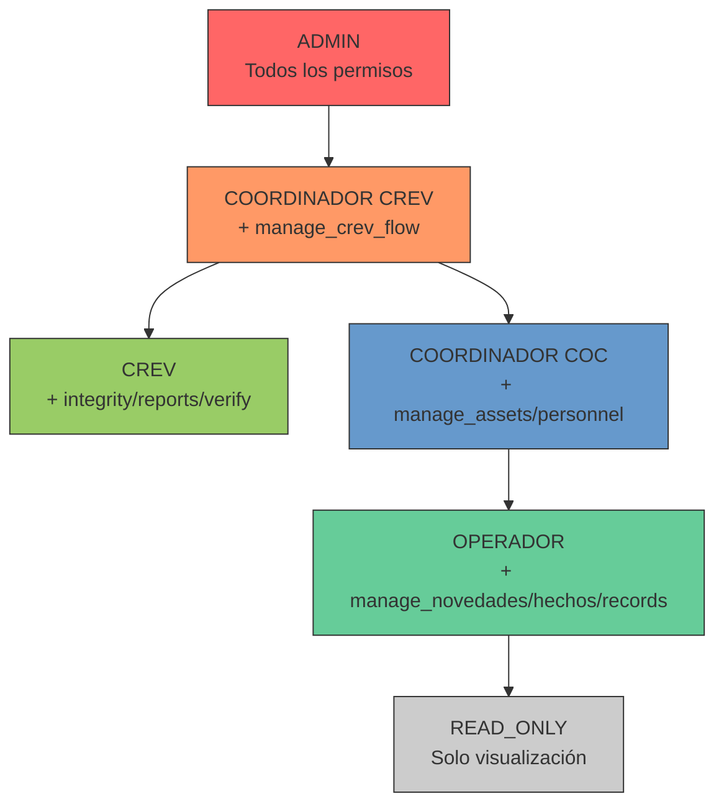
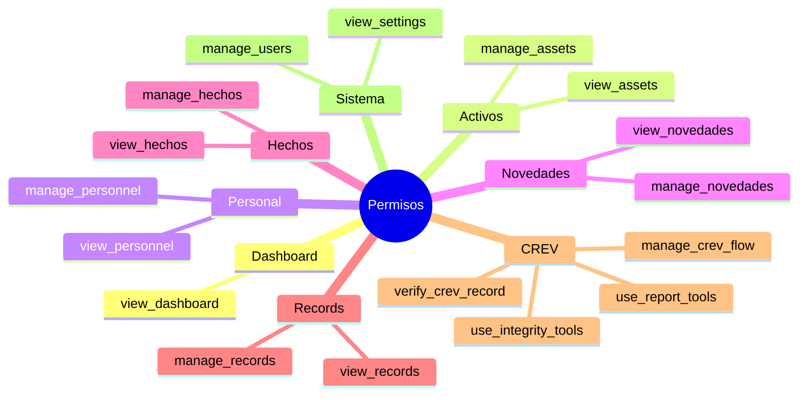
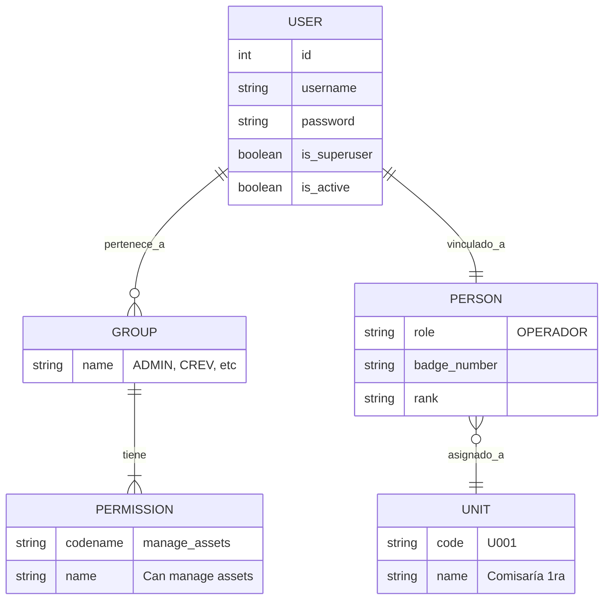
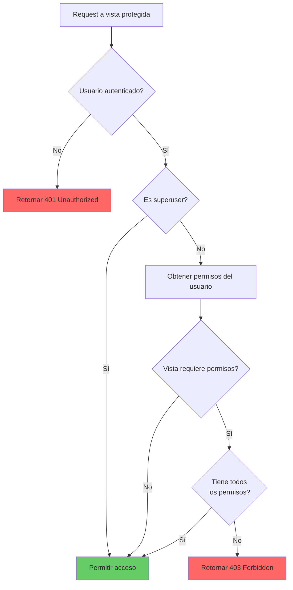
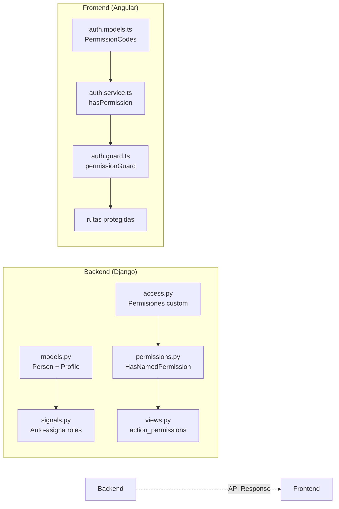

# Diagramas de Roles y Permisos

## Flujo de Autenticación y Autorización

## Jerarquía de Roles

## Matriz de Permisos Visual

## Asignación de Roles a Usuarios

## Flujo de Verificación de Permisos

## Componentes del Sistema de Permisos

---

*Documentación complementaria a `2-roles-and-permissions.md`*
